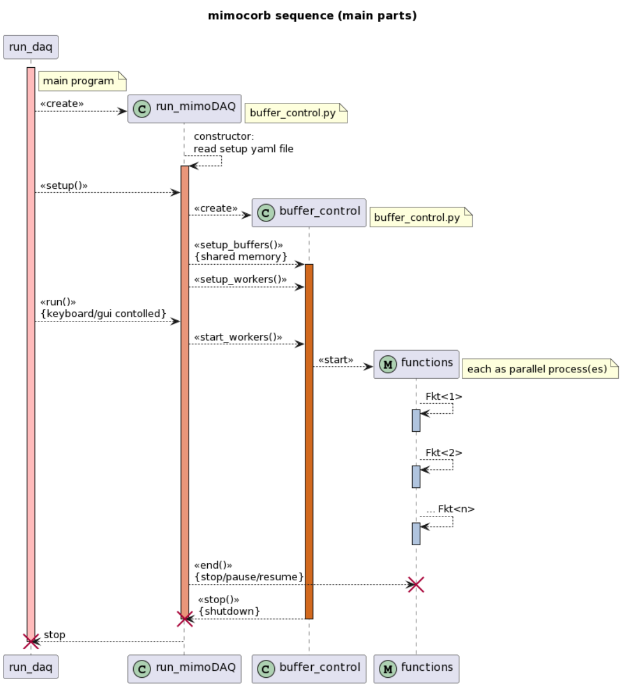

===========================================================
mimoCoRB - multiple-in multile-out Configurable Ring Buffer
===========================================================

mimoCoRB -  multiple-in multile-out Configurable Ring Buffer: Overview
----------------------------------------------------------------------

**mimoCoRB**: multiple-in multiple-out Configurable Ring Buffer

The package **mimoCoRB** provides a central component of each data acquisition
system needed to record and pre-analyse data from randomly occurring processes.
Typical examples are waveform data as provided by detectors common in quantum
mechanical measurements, or in nuclear, particle physics and astro particle
physics, e. g. photo tubes, Geiger counters, avalanche photo-diodes or modern
SiPMs.

The random nature of such processes and the need to keep read-out dead
times low requires an input buffer for fast collection of data and an
efficient buffer manager delivering a constant data stream to the subsequent
processing steps. 
While a data source feeds data into the buffer, consumer processes receive the
data to filter, reduce, analyze or simply visualize the recorded data. In
order to optimally use the available resources, multi-core and multi-processing
techniques must be applied.
Data consumers may be obligatory ones, i. e. data acquisition pauses if
all input buffers are full and an obligatory consumer is still busy
processing. A second type of consumer (random consumers or "observers") 
receives an event copy from the buffer manager upon request, without interrupting 
the data acquisition process. Typical examples of random consumers are
displays of a subset of the wave forms or of intermediate analysis
results.

This project originated from an effort to structure and generalize
data acquisition for several experiments in advanced physics laboratory
courses at Karlsruhe Institute of Technology (KIT).

As a simple demonstration, we provide data from simulated signals as would
be recorded by a detector for cosmic muons with four detection layers.
Occasionally, such muons stop in an absorber between the 2nd and 3rd layer,
where they decay at rest and emit a high-energetic electron recorded as a
2nd pulse in one or two of the detection layers. After data acquisition, a
search for typical pulse shapes is performed and data with detected double
pulses are selected and copied into a second buffer. A third buffer receives
data in a reduced format which only contains the parameters of accepted pulses.
These data and the wave forms of all double-pulses are finally stored
on disk. Such an application is a very typical example of the general
process of on-line data processing in modern physics experiments and may
serve as a starting point for own projects.

.. toctree::
   :maxdepth: 2
   :caption: Contents:

Description of components
.........................

In order to decouple the random occurrence of "events" one needs a
buffer capable of rapidly storing new incoming data and delivering
a constant data stream to subsequent consumer processes. 
This is typically implemented as a first-in, first out ringbuffer 
providing storage space in memory for incoming data, which is 
released and overwritten by new data when all consuming processes 
have finished.

As digital filtering of incoming data may be very CPU intensive,
multi-processing and multi-core capable components are needed to
ensure sufficient compute power to process and analyze data.
`mimoCoRB.mimo_buffer` implements such a buffer allowing multiple 
processes to read ("multiple out") or write ("multiple in") to a
shared buffer space. 

Because processing of the data, i.e. digital filtering, selection, 
compression and storage or real-time visualization of the data can 
be a complex workflow, buffers may be arranged in chains where one 
or several reader processes of a buffer write to one or several 
output buffer(s). 

The central component takes care of memory management and access
control provided by the class **newBuffer**. To control the data
flow in a full data acquisition suite, three types of access are
needed, implemented as  **Writer**, **Reader** and **Observer**
classes. Readers of the same type are grouped together for
multi-processing of compute-intense tasks and form a Reader-group. 
Observers receive only a sub-set of the data and are mainly 
intended to be used for visual inspection or graphical representation
of samples of the recorded or processed data. 

Processes for data provisioning from front-end hardware or 
from other sources, like disk files, web streams or simulation,
rely on the Writer class; similarly, processes reading data for 
filtering and transfer to subsequent buffers or to analyse, transform
or extract data to storage media use the Reader class.
Note that the buffer manager ensures that every slot assigned to a 
Reader (or a group  of Readers) is actually processed; therefore, 
input to a buffer blocks if the buffer is filled up completely.
The Writer class resumes data input as soon as a Reader or member of
a Reader-group has finished processing and thus freed a slot in the 
buffer.

Multiprocessing is enabled by use of the *shared_memory* module
of the *multiprocessing* package available since Python 3.8 for
direct access to shared memory across processes. Other modules
of the package (*Process*, *Lock*, *Event*, and *SimpleQueue*
or *Queue*) are used to create and control sub-processes and for
signalling and message or data exchange across processes. 

The format of data stored in the buffers is based on structured
*numpy* arrays with (configurable) field names and *numpy* *dtypes*.  
Each buffer entry is also associated with a unique number, a time 
stamp and a deadtime fraction to be provided by the initial
data producer. The deadtime accounts for inefficiencies of the
data acquisition due to processing in *mimoCoRB*. These metadata are 
set by the initial producer and must not be changed at a later stage 
in the processing chain. 

Simple application example 
..........................

An application example of *mimo_buffer* is shown below;
it is also provided as a unit test. The set-up is as follows:

  Two ring buffers are defined:

    - input Buffer  RB_1: 10 ch x 1024 slots (int32)

    - output Buffer RB_2: 10 ch x 2 slots/ch (float64)

    Simple data is filled into RB_1, copied and extended by a process
    writing data into RB_2, and finally a reader process to check
    integrity and completeness of the data. The most complex part of
    the code is in function *run_control()*, which demonstrates
    how to set up the buffers, define Reader and Writer instances
    and start the parallel processes for generating, processing
    and reading the data. 

The example including comment lines for explanation is shown here:

.. code-block:: python

  import time
  import unittest
  import numpy as np
  from multiprocessing import Process, Value
  from mimocorb import mimo_buffer as bm

  # global variables 
  N_requested = 1000  # number of data injections ("events")
  Time_tick = 0.001   # time between events
  Ncpu1 = 2           # number of parallel analyzer processes

  def data_generator(sink_dict):
    """writes continuously rising integers to buffer specified in sink_dict
    """
    sink = bm.Writer(sink_dict)
    n=0
    # inject data
    for x in range(N_requested):
        buffer = sink.get_new_buffer() # get new buffer and pass last item
        #  random wait for next data item
        time.sleep(-Time_tick*np.log(np.random.rand() ))
        # fill "data"
        n += 1
        buffer[:] = n
    # process last data item
    sink.process_buffer()

  def analyzer(source_dict, sink_dict):
    """read from source and write first element and a time difference to sink
    """
    source = bm.Reader(source_dict)
    sink = bm.Writer(sink_dict)
    start_time = time.time()
    
    while True:
        input_data = source.get()
        output_data = sink.get_new_buffer()
        # process data
        output_data[0] = input_data[0]
        # mimick processing time
        time.sleep(2*Time_tick)
        output_data[1] = time.time() - start_time

        # 
        sink.process_buffer()

  def check_result(source_dict, res):
    """reads RB_2 and sum up the integer content

       sum is returned as shared memory Value-object
    """
    source = bm.Reader(source_dict)
    sum_rb = 0
    while True:
        input_data = source.get()
        res.value +=int(input_data[0])

  def run_control():
    """Setup buffers, start processes and shut_down when 1st writer done 
    """

    # Create ring buffers: #2: 10 channel, 2 value per channel
    #    (1: buffer content; 2: time difference as int)
    #    d_type = [('chA', np.float)]  #not necessary: always the same type
    generator_buffer = bm.NewBuffer(10, 1, np.int32)
    eval_buffer = bm.NewBuffer(10, 2, np.float32)

    # create readers first
    source_dic_gen = generator_buffer.new_reader_group()
    source_dic_eval = eval_buffer.new_reader_group()

    # Create worker processes (correct sequence: first action as last)
    process_list = []
    #  evaluation to test ring buffer behavior
    result = Value('i', 0)   # int variable in shared meomry
    process_list.append(Process(target=check_result,
                                args=(source_dic_eval, result)))
    # data transfer between the 2 buffers: generator_buffer -> eval_buffer
    sink_dic_eval = eval_buffer.new_writer()
    # work with all cpu's requested
    number_of_workers = Ncpu1
    for i in range(number_of_workers):
        process_list.append(Process(target=analyzer,
                                    args=(source_dic_gen, sink_dic_eval)))

    # fill buffer (generator_buffer) with data first
    sink_dic_gen = generator_buffer.new_writer()
    process_list.append(Process(target=data_generator,
                                args=(sink_dic_gen,)))

    for p in process_list:
        p.start()

    run_active = True
    while run_active:
       run_active = False if process_list[-1].exitcode==0 else True
       time.sleep(0.1)  # wait
    time.sleep(0.1)  # some grace-time for readers to finish

    generator_buffer.shutdown()
    eval_buffer.shutdown()
    del generator_buffer, eval_buffer

    for p in process_list:
        p.join()

    return result.value

  class RPTest(unittest.TestCase):

    def test_process(self):
        # start python test module and check result
        a = run_control()
        expected_result = N_requested*(N_requested+1)//2
               # expected result: sum(i); i = 1, N_requested	
        self.assertEqual(a, expected_result)

  if __name__ == "__main__":
    unittest.main(verbosity=2)
  #    print(process_buffer())

Access Classes in the module *buffer_control*
---------------------------------------------

To facilitate user interaction with the buffer manager a set of additional classes 
is provided in the module *buffer_control* to set-up and manage cascades of 
ringbuffers and the associated functions for filling, filtering and extracting
data. These classes are also interesting for developers wanting to help improving
the package. 

The classes are: 

  - `class buffer_control`
      Set-up and management of ringbuffers and associated sub-processes.
      This is the overarching class with access to all created buffers and sub-processes.

  - `class rbImport`
      Read data from source (front-end like a PicoScope USB oscilloscope, of from file or simulation) 
      and put data in a mimo_buffer. Data input is handled by a call of a user-supplied
      Python generator (i.e. via 'yield()') for data and metadata.

  - `class rbTransfer`
      Read data from a mimo_buffer, filter and/or reformat data and write to output mimo_buffer(s).
      Data is provided as the argument to a user-defined filter function returning *None* if data 
      is to be discarded, a number if data is to be copied to another buffer, or - optionally - a 
      list of transformed data records produced from processed input data. If such data are 
      provided, a respective number of ringbuffers as destination must be configured.
      
  - `class rbExport`
      Read data from mimo_buffer and analyze (with user-supplied code), without writing
      to another ringbuffer. Data is expected to be provided by a Python generator in 
      the __call__() method of the class yielding a tuple of data and metadata. 
      
  - `class rbObserver`
      Deliver data from a buffer to an observer process. A tuple (data, metadata) is
      provided by a Python generator implemented in the __call__() method of the class. 
      
  - `class rb_toTxtfile`:
      Save mimo_buffer data to a file in csv-format. The header line of this file contains
      the keys of the respective columns, which are derived from the datatype of the structured
      ringbuffer array. Aliases for improved clarity can be provided in the configuration file. 
      
  - `class rb_toParquetfile`:
      Save mimo_buffer data to an archive in  *tar* format; each data record is packed in
      Parquet format.

  - `class run_mimoDAQ`
      Setup and run a Data Acquisition suite with the mimoCoRB buffer manager.   
      The layout of ringbuffers and associated functions are defined in
      a configuration file in *yaml* format. All configured functions are 
      executed as worker processes in separate sub-processes and therefore 
      optimal use is made of of multi-core architectures. 

  -  class `bufferinfoGUI`:
      A graphical interface showing buffer rates and status information 
      and providing some control buttons interacting with the run_mimoDAQ
      class. 
    
These classes shield much of the complexity from the user, who can thus concentrate
on writing the pieces of code need to acquire and process the data. 
The access classes expect as input lists of dictionaries with the parameters
of buffers to read from (**source_list**), to write to (**sink_list**) or to
observe (**observe_list**). An additional dictionary (**config_dict**) provides
the parameters needed for the specific functionality, for example names of
functions to read, filter or manipulate data or the names of target files.
The interface for passing data between the user-defined functions and ringbuffers
relies on Python generators (i.e. the *yield* instruction).

The overarching class **buffer_control** provides methods to setup buffers and 
worker processes and to control the data acquisition process. The methods 
collected in the class *run_mimoDAQ*, in particular the function **run_mimoDAQ**,
contains the code needed to run a real example of a data-acquisition suite defined
in a configuration file specifying the associated, user-defined functions for 
data provisioning, filtering and storage. *run_mimoDAQ* is controlled either
by keyboard commands of from a graphical user interface; pre-defined conditions
on the total number of events processed, the duration of the data taking run
or finishing of the writer process to the first buffer due to source exhaustion
can also be defined to end data taking. The class structure and dependencies
are shown in the figure below.

.. image:: class_structure.png
  :width: 1024
  :alt: The structure of a mimoCoRB project

	
	
A sequence diagram of a a typical application and the is shown below. This
illustrates the interplay and dependencies of the main program *run_daq.py*
with the buffer manager and the user-supplied functions.

	
For complex setups and longer data-taking periods it is important to gain 
a quick overview of the status of all buffers and to monitor long-term stability. 
Therefore, a graphical display with the processing rate of all buffers is
provided by the class **bufferinfoGUI**. A text window receives frequent 
updates of the number of events processed by each buffer and of the buffer 
fill-levels. Klickable control buttons send information via a dedicated
command queue to the calling process *run_mimoDAQ* and enable pausing,
resuming and controlled ending of the data-acquisition processes.

The suggested structure of the project work-space for mimiCoRB applications 
is as follows:

.. code-block::

  |--> <user working directory>       # the main configuration script resides here
                    |
                    | --> modules     # project-specific, user-supplied python code
                    | --> config      # configuration files in yaml format
                    | --> target      # output of data-acquisition run(s)

For illustration and as a starting point for own applications, a stand-alone example 
is provided as part of the package, as described in the following section. 
                    

Application example
...................

The subdirectory *examples/* contains a rather complete application use case.
It runs stand-alone and uses as input simulated waveform data of short pulses
in a scintillator detector. The simulated physics process corresponds to 
signatures produced by cosmic muons. Of particular interest in this case are 
(rare) signatures with a double-pulse structure, where the first pulse originates
from a detected muon and the second one from a decay electron of a muon that
has been stopped in or near a detection layer. 

Examples of code snippets and configuration data are provided in the 
subdirectories `examples/modules/` and `examples/config/`, respectively.
Waveform data, as provided by, for example, a multi-channel digital
oscilloscope, are generated and filled into the first one of a cascaded set
of three ringbuffers. The raw data are analyzed, and accepted data with a
double-pulse signature are selected and directly passed on to a second
ringbuffer. A third buffer contains only the information on found
signal pulses; a result file in *csv* format contains the data extracted
from this buffer. Configuration files and the recorded data files are stored
in the subdirectory `examples/target/<projectname>_<date_and_time>`. 

A graphical representation of the set-up is shown in the figure 
below [source: Master's Thesis Christoph Mayer, ETP 2022].
Note that the oscilloscope is replaced by a signal simulation in the 
provided example. 

.. image:: mimoCoRB_lifetime.png
  :width: 650
  :alt: The signal processing chain for the lifetime measurement	  

The buffer layout and the associated functions are defined in the main
configuration file `simulsource_setup.py`, which serves as the input to 
the execution script `run_daq.py` in the top-level directory of the package. 
The *python* files `simulation_source.py`, `liftime_filter.py` and
`save_files.py` contain the user code for data generation, analysis
and filtering and extraction of the finally accepted data to disk files. 
The `.yaml` files `simulation_config.yaml` and `save_lifetimes.yaml` contain 
configurable parameters provided to these functions.

This example is executed form the directory `examples/` by entering:

  `../run_daq.py simulsource_setup.yaml`

The code needed to run a data acquisition based on the package
*mimocorb.buffer_control.run_mimoDAQ* is shown here: 

.. code-block:: python

  # script run_daq.py

  from mimocorb.buffer_control import run_mimoDAQ
  daq = run_mimoDAQ()
  daq.setup()
  daq.run()

The input *yaml* file for the example provided as part of the package looks
as follows: 

.. code-block:: yaml
		
  #  Application example for mimoCoRB
  #  --------------------------------

  RingBuffer:
    # define ring buffers
    - RB_1:
        # raw input data buffer (waveforms from PicoScope, file_source or simulation_source)
        number_of_slots: 128
        channel_per_slot: 4250
        data_type:
            1: ['chA', "float64"]
            2: ['chB', "float64"]
            3: ['chC', "float64"]
            4: ['chD', "float64"]          
    - RB_2:
        # buffer with accepted signatures (here double-pulses)
        number_of_slots: 128
        channel_per_slot: 4250
        data_type:
            1: ['chA', "float64"]
            2: ['chB', "float64"]
            3: ['chC', "float64"]
            4: ['chD', "float64"]          
    - RB_3:
        # buffer with pulse parameters (derived from waveforms)
        number_of_slots: 32
        channel_per_slot: 1
        data_type:
            1: ['decay_time', "int32"]
            3: ['1st_chA_h', "float64"]
            4: ['1st_chB_h', "float64"]
            5: ['1st_chC_h', "float64"]          
            6: ['1st_chA_p', "int32"]
            7: ['1st_chB_p', "int32"]
            8: ['1st_chC_p', "int32"]
            9: ['1st_chA_int', "float64"]
            10: ['1st_chB_int', "float64"]
            11: ['1st_chC_int', "float64"]
            12: ['2nd_chA_h', "float64"]
            13: ['2nd_chB_h', "float64"]
            14: ['2nd_chC_h', "float64"]
            15: ['2nd_chA_p', "int32"]
            16: ['2nd_chB_p', "int32"]
            17: ['2nd_chC_p', "int32"]
            18: ['2nd_chA_int', "float64"]
            19: ['2nd_chB_int', "float64"]
            20: ['2nd_chC_int', "float64"]
            21: ['1st_chD_h', "float64"]
            22: ['1st_chD_p', "int32"]
            23: ['1st_chD_int', "float64"]
            24: ['2nd_chD_h', "float64"]
            25: ['2nd_chD_p', "int32"]
            26: ['2nd_chD_int', "float64"]

  Functions:
    # define functions and assignments
    - Fkt_main:
        config_file: "config/simulation_config.yaml"
    - Fkt_1:
         file_name: "modules/simulation_source"
         fkt_name: "simulation_source"
         num_process: 1
         RB_assign:
             RB_1: "write"
    - Fkt_2:
         file_name: "modules/lifetime_filter"
         fkt_name: "calculate_decay_time"
         num_process: 2
         RB_assign:
             RB_1: "read"     # input
             RB_2: "write"    # waveform to save (if double pulse was found)
             RB_3: "write"    # pulse data
    - Fkt_3:
        file_name: "modules/save_files"
        fkt_name: "save_to_txt"
        config_file: "config/save_lifetime.yaml"
        num_process: 1
        RB_assign:
             RB_3: "read"     # pulse data
    - Fkt_4:
        file_name: "modules/save_files"
        fkt_name: "save_parquet"
        num_process: 1
        RB_assign:
             RB_2: "read"     # waveform to save

The configuration file referenced in the line 
`config_file: "config/simulation_config.yaml"` provides the
information needed by the user-supplied functions.

The example coming with this package contains two more convenience
functions, one for an observer process displaying a random sample of
waveforms in an oscilloscope display, and a second one for on-line
analysis and histogramming of buffer data. The addendum to the
configuration looks as follows: 

.. code-block:: yaml
		
   - Fkt_5:
        file_name: "modules/plot_waveform"
        fkt_name: "plot_waveform"
        num_process: 1
        RB_assign:
             RB_2: "observe"  # double pulse waveform
    - Fkt_6:
        file_name: "modules/plot_histograms"
        fkt_name: "plot_histograms"
        num_process: 1
        RB_assign:
           RB_3: "read"  # pulse parameters

These additional functions rely on the modules `mimocorb.plot_buffer` and
`mimocorb.histogram_buffer`, which provide animated displays of waveforms
similar to an oscilloscope and a histogram package for life-updates of
frequency distributions of scalar variables. Configuration parameters needed 
for the functions associated to the ringbuffers can either be specified
as a *yaml* block under a keyword in the general configuration file that
is assigned to the function *Fkt_main* in the example above. 
Alternatively, a dedicated configuration file can be specified in a separate
*yaml* file, as is done for function *Fkt_3* in the example. This latter
feature is particularly useful if the same function code is used to 
handle data from different buffers, e.g. writing buffer contents to a 
file in *csv* format. 

The functions are started as sub-processes and have a unique interface. Lists of dictionaries
provide the necessary information to connect to the buffer manager via the *Writer*, *Reader*
or *Observer* classes of the package. This information comprises the pointer to the shared
buffer manager as well as pointers to instances of the functions *Event()* or *Queue()*
from the multiprocessing package to enable communication and data transfers across processes.
A further dictionary (*config_dict*) provides the function-specific parameters
discussed previously. 
The keyword dictionary *rb_info* specifies whether writer, reader or observer functionality 
is required. The function interface looks as follows:

.. code-block:: python

  def <function_name>(
    source_list=None, sink_list=None, observe_list=None, config_dict=None, **rb_info):

This interface must be respected by any user function. The argument list must also be
passed to instances of the access classes *rbImort*, *rbExport*, *rbTransfer* or
*rbObserve*. An example of a user fuction in the directory *modules/* to write bufer
data to a text file is shown below:

.. code-block:: python

  """Module save_files to handle file I/O for data in txt and parquet format

     This module relies on classes in mimocorb.buffer_control
  """
  from mimocorb.buffer_control import rb_toTxtfile, rb_toParquetfile
  def save_to_txt(source_list=None, sink_list=None, observe_list=None, config_dict=None, **rb_info):
      sv = rb_toTxtfile(source_list=source_list, config_dict=config_dict, **rb_info)
      sv()

Examples showing how to implement user-supplied functions to interact with
*mimiCoRB* are provided in the subdirectory *examples/* of the *mimiCoRB* package.
The example described above is defined in the configuration file *simul_source_setup.yam*; 
a more complex case with two streams  going to different output buffers and files is specified
in the file simul_spin_setup.yaml. Starting this example with 
`>  ../run_daq.py simul_spin_setup.yaml` leads to the following terminal output:

.. code-block::

 *==* script ../run_daq.py running 

  4 buffers created...  List of buffers
  RB_1 128 4250
  RB_2 128 4250
  RB_3 32 1
  RB_4 32 1
  List of functions
  FKT_1 simulation_source (1)   {'RB_1': 'write'}
  FKT_2 calculate_decay_time (2)   {'RB_1': 'read', 'RB_2': 'write', 'RB_3': 'write', 'RB_4': 'write'}
  FKT_3 save_to_txt (1)   {'RB_3': 'read'}
  FKT_4 save_to_txt (1)   {'RB_4': 'read'}
  FKT_5 save_parquet (1)   {'RB_2': 'read'}
  FKT_6 plot_waveform (1)   {'RB_2': 'observe'}
  FKT_7 plot_histograms (1)   {'RB_3': 'read'}
  FKT_8 plot_histograms (1)   {'RB_4': 'read'}

  Running 260s RB_1: 76409(0) 302Hz RB_2: 6118(0) 19Hz RB_3: 2952(1) 9.99Hz RB_4: 3166(1) 8.99Hz  

A screenshot of a data-acquisition run with input from simulated data is shown
in the figure below.

.. image:: mimoCoRB_screenshot.png
  :width: 1024
  :alt: Screenshot of a simulation run

====================
Module Documentation 
====================

.. automodule:: mimocorb
     :imported-members:
     :members:

.. automodule:: mimocorb.mimo_buffer
     :members:

.. automodule:: mimocorb.buffer_control
     :members:

.. automodule:: mimocorb.bufferinfoGUI
      :members:

.. automodule:: mimocorb.plot_buffer
     :members:

.. automodule:: mimocorb.histogram_buffer
     :members:
       
.. automodule:: rb_unittest

.. automodule:: simulation_source
     :members:

.. automodule:: lifetime_filter
     :members:

.. automodule:: plot_waveform
     :members:

.. automodule:: plot_histograms
     :members:	
